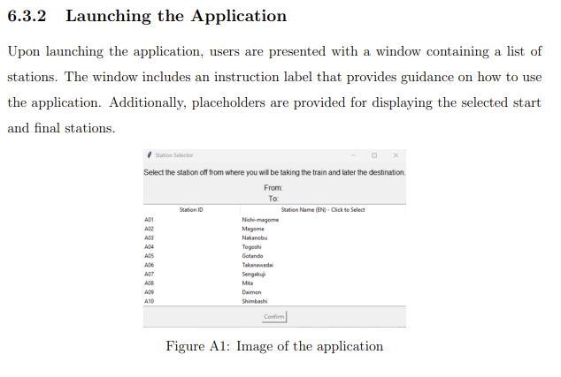

*Programming language:* Python

*Libraries:*
 os
 time
 networkx as nx
 matplotlib.pyplot as plt
 random
 pandas as pd
 IPython.display import display
 tkinter
 json
 matplotlib.backends.backend_tkagg import FigureCanvasTkAgg

*Enviroment:* Jupyter Notebook from Anaconda Navigator

*How to run:* 
Step 1. Station.json has to be in the same directory as TokyoMetro_AntColonyOptimazation_Algorithm_Final.ipynb \n
Step 2. In order to activate the GUI application, you need to use Anaconda navigator > Jupyter Notebook.
Step 3. When you are inside Jupyter Notebook, select TokyoMetro_AntColonyOptimazation_Algorithm_Final.ipynb.
Step 4. Run TokyoMetro_AntColonyOptimazation_Algorithm_Final.ipynb.

-------------------------------------------------------

